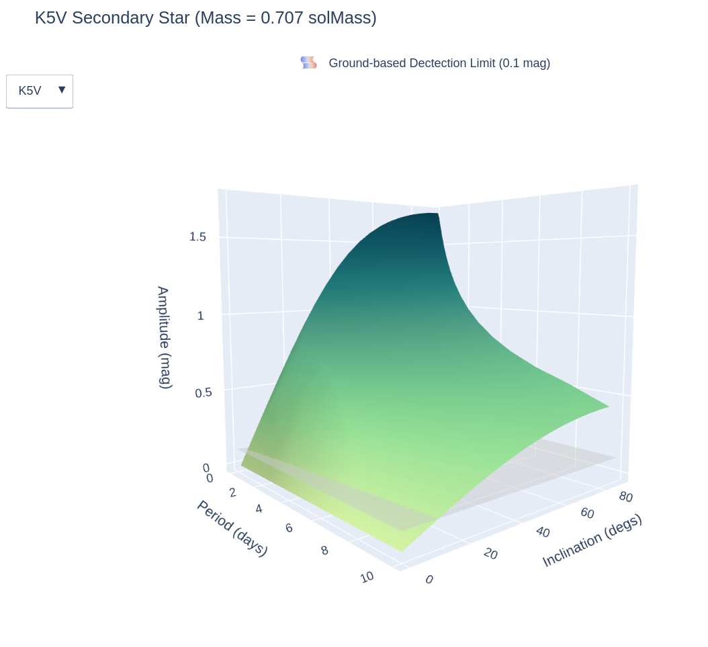

### Description

#### Here the parameters of low mass Dwarf stars (from spectral class K5V to L2) from Table 6 in [*Cifuentes, et. al. (2020)*](https://ui.adsabs.harvard.edu/abs/2020A%26A...642A.115C/abstract) were used as the secondary stars in the white dwarf binary model. A script adpated from [`BB_prototype.py`](https://github.com/george-hummus/PHOEBE/blob/main/Final_Protoype/BB_prototype.py) was used to calucate the light curve amplitudes of these binaries at different periods and inclinations. This required implementing manual limb-darkening into the atmopshere model of the MS star using tables calulated by [*Claret, et. al. (2012)*](https://www.aanda.org/articles/aa/full_html/2012/10/aa19849-12/aa19849-12.html) based on the Phoenix model atmosphere. 

#### Using this data, an interactive figure was created using a script based on [`plotly_surface.py`](https://github.com/george-hummus/PHOEBE/blob/main/interactive_plots/plotly_surface.py). Here is a still of the plot:

#### Or you can view the interactive version [here](https://htmlpreview.github.io/?https://github.com/george-hummus/PHOEBE/blob/main/CARMENES/outputs/CARMENES_surface.html).

