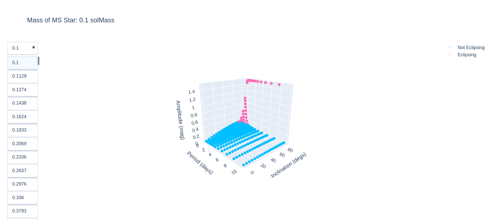

## WARNING - `plotly` surface plots are incorrect and need to be de-bugged, so don't take the values in these interactive plots as true.

### Here is an image of the surface plot of the amplitudes made in `plotly`:

#### Launch interactive version [here](https://htmlpreview.github.io/?https://github.com/george-hummus/PHOEBE/blob/main/interactive_plots/plotly_surface.html) (made with plotly_surface.py)

### Here is a still of the `plotly` interactive plot with drop-down menu:

#### Launch interactive version [here](https://htmlpreview.github.io/?https://github.com/george-hummus/PHOEBE/blob/main/interactive_plots/plotly_dropdown.html) (made with plotly_dropdown.py)

### Here is a still of the gird of `plotly` interactive plots:

#### Launch interactive version [here](https://htmlpreview.github.io/?https://github.com/george-hummus/PHOEBE/blob/main/interactive_plots/plotly_example.html) (made with plotly_example.py)

### Here is an image of the interface used to interact with the plot produced with v2:

#### (made with iFig_prototype_v2.py)
